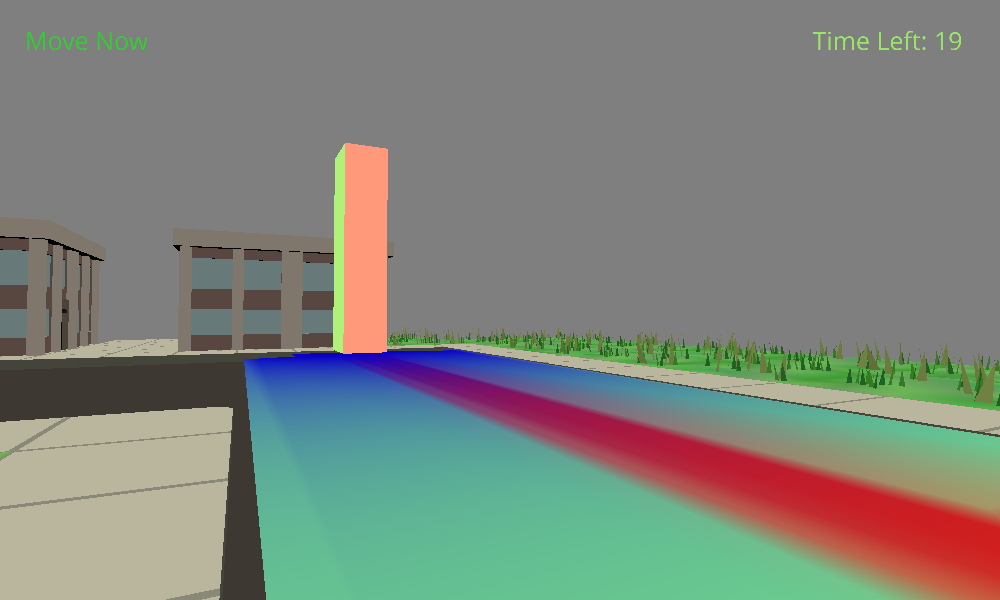

# Red Light, Green Light

### Author: 
Chunan (Oscar) Huang

### Design: 
Mimic a popular children game "red light, green light", which is used in a popular TV show "Squid Game".
Basically you need to reach the "goal", but you can only move when is couting down (sound playing).
You die if you are still moving when the sound stops.
One difference I made here is that I added momentum (so you may need to stop earlier or use other tricks).  

Screen Shot:

### How To Play:
WASD to move. Mouse to rotate view. Escape to reactivate mouse cursor.

### Sources: 
#### 3d models
The main scene is adapted from city.blend by Jim McCann.  
Model Credits: https://github.com/15-466/15-466-f21-base2/blob/main/scenes/CREDITS.txt  
#### Sounds
count down sound: https://www.youtube.com/watch?v=qWzZeqSK7b8  
gun shot sound: https://www.fesliyanstudios.com/royalty-free-sound-effects-download/gun-shooting-300  
Victory sound effect: https://elements.envato.com/victory-DRKGYPE?utm_source=mixkit&utm_medium=referral&utm_campaign=elements_mixkit_cs_sfx_search_no_results&_ga=2.5332721.397766831.1632603381-1120883937.1632603381  
#### Fonts
https://www.fontspace.com/open-sans-font-f22353  
https://www.fontspace.com/serat-font-f57208
#### Reference
Game idea from TV show Squid Game: https://www.youtube.com/watch?v=oqxAJKy0ii4  
Walk mesh code learned from class discussion and https://github.com/GenBrg/TankSurvive/blob/master/WalkMesh.cpp  
Project developed from https://github.com/15-466/15-466-f21-base5  

This game was built with [NEST](NEST.md).

